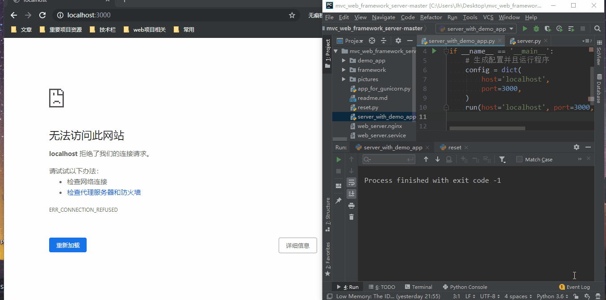

# 基于 Socket 的 HTTP Server 与 MVC Web 框架

## 功能介绍
- HTTP Server
  - 本项目实现底层基于 Socket 实现 HTTP 服务器，实现了 TCP/IP 通信过程。
    - 在性能上使用多线程实现并发访问。
    - 在功能上实现了 HTTP 请求的接收、解析、响应生成、再返回响应发送至客户端。

- MVC (Model-View-Controller) Web 框架：
   - Model 框架层：使用了 MySQL并自制ORM（对象关系映射）实现增删改查接口的封装。
   - View 视图层：使用 Jinja2 渲染模板实现数据的有序显示，提高开发效率。
   - Controller 控制器：使用 Python 高阶函数，  实现路由分发、权限验证等功能。
   其中包含数据实例化、重定向、特定格式数据返回等辅助功能。

## 功能演示
### 1.注册登录演示，查看请求解析并返回响应的过程
### 2.微博增删改查，微博权限控制功能演示
  

## 运行环境
Windows10
python 3.6
```
pip install pymysql jinja2
```
## 本地测试
```
python reset.py
python server_with_demo_app.py
```
